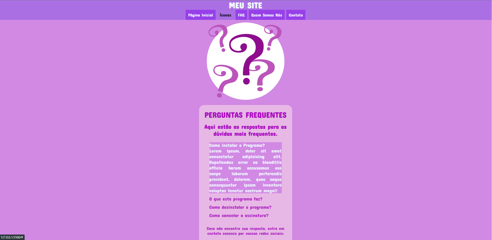

# FAQ 

# Sobre o projeto

Terceiro projeto realizado para a Mentoria CSV - e também o terceiro projeto que fiz como DEV - consistente em uma página de FAQ em HTML5 e CSS3, com pouca utilização de JS. 

A página é responsiva e você pode ter acesso a ela pelo link https://scintillating-tapioca-bb75d1.netlify.app.

## Layout mobile
  

## Layout web

# Tecnologias utilizadas

## Front end
- HTML / CSS / JS / TypeScript

# Autor

Giovanni Affornalli Feltrin

www.linkedin.com/in/giovanni-a-feltrin

